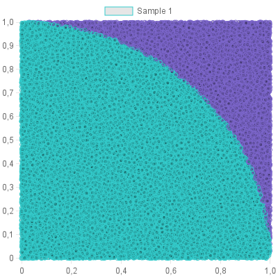

# Node.js - Monte Carlo Methods

Node.js project to do some math calculations, such PI value or Integral Calculus, with the Monte Carlo method

The main idea is to generate a huge quantity of random numbers, take pairs of them (like a point, with coordinates x and y) and then classify this points according a equation.
For example, to calculate PI the point must agree with `x² + y² <= 1`.
After checking all points, you'll count how many of them agree with the equation and will divide it by the total of points. And this will give you the value of PI, or the result of a Integral.

It's pretty cool to implement and to see the generated charts.



Increase the values of the variables
```js
const chartWidth = 1000;
const chartHeight = 1000;

const multiplier = Math.pow(10, 6)
const base = 1
```
to have more reliable results. But, this cost a lot of memory to run, and I intend to increase the performance someday.

Thanks to my teacher [Carmen](https://bv.fapesp.br/pt/pesquisador/38029/carmen-maria-andreazza)!
